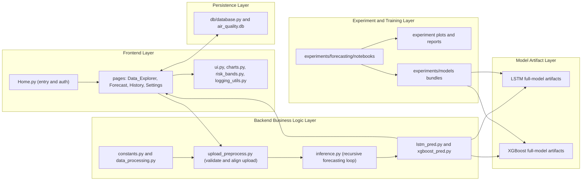
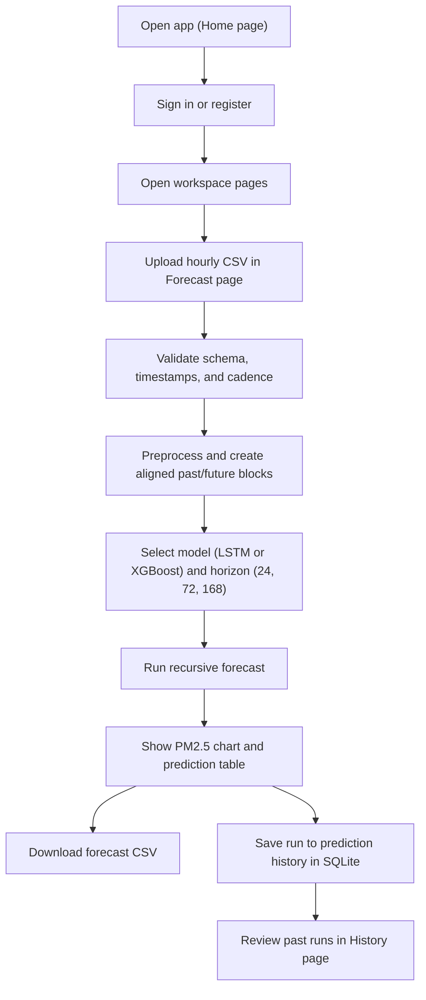
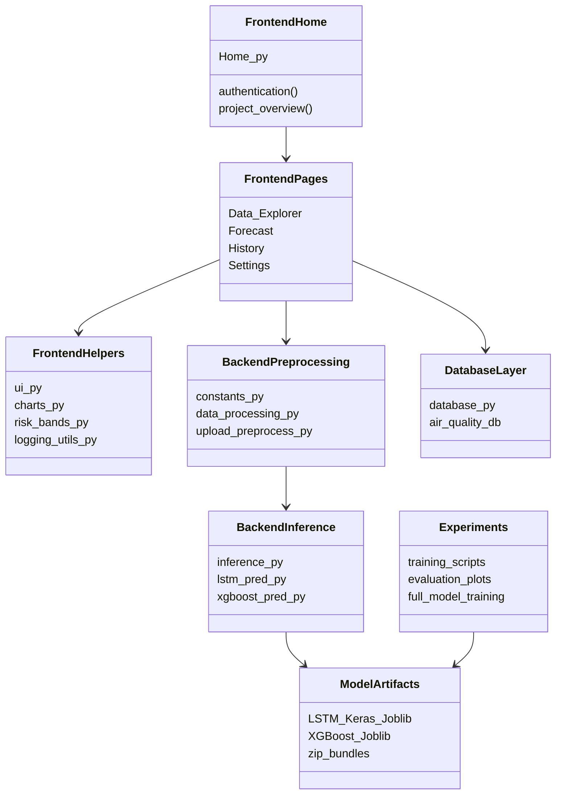

# Air Quality Forecasting Platform

This project is a research-oriented air-quality forecasting platform for hourly pollutant prediction. It combines a Streamlit user interface, a Python backend, SQLite persistence, and trained machine learning/deep learning models for multivariate forecasting with LSTM and XGBoost.

The forecasting pipelines use recent pollutant history, weather inputs, and calendar/Fourier time features to predict multiple pollutants. The repository also contains experiment scripts, training outputs, plots, tests, and model artifacts used to support thesis, research, and code-review work.

## Main Features

- Hourly air-quality forecasting for supported horizons of 24, 72, and 168 hours.
- Multivariate input data with pollutant history, weather drivers, and cyclic time features.
- Pollutant prediction for `pm10`, `pm2_5`, `carbon_monoxide`, `nitrogen_dioxide`, `sulphur_dioxide`, and `ozone`.
- Weather-aware forecasting using user-provided future `temperature` and `wind_speed`.
- Streamlit web interface with authentication, data exploration, forecasting, history, and settings pages.
- Clear separation between frontend, backend, database, experiments, data, and tests.
- SQLite support for users, auth tokens, settings, and saved prediction history.
- Experiment structure for training, evaluation, plots, and full-dataset model artifacts.
- LSTM and XGBoost pipelines for comparing sequence models and tree-based tabular models.

## Repository Structure

```text
.
├── app.py
├── README.md
├── requirements.txt
├── pyproject.toml
├── run_tests.py
└── src/
    ├── back_end/
    │   ├── __init__.py
    │   ├── constants.py
    │   ├── data_processing.py
    │   ├── inference.py
    │   ├── lstm_pred.py
    │   ├── upload_preprocess.py
    │   └── xgboost_pred.py
    ├── db/
    ├── front_end/
    ├── data/
    ├── experiments/
    └── tests/
```

### Folder Purposes

| Path | Purpose |
| --- | --- |
| `src/back_end/` | Core data validation, preprocessing, model loading, and recursive inference logic. |
| `src/front_end/` | Streamlit application pages, shared UI helpers, styling, charts, and PM2.5 risk labels. |
| `src/db/` | SQLite persistence for accounts, sessions, settings, and prediction history. |
| `src/data/` | Runtime dataset files used by project code (currently `london_2024.csv`). |
| `src/experiments/` | Offline training and evaluation scripts, experiment datasets, plots, and model bundles. |
| `src/tests/` | Pytest suite for backend preprocessing, database behavior, and upload-forecast inference logic. |
| `app.py` | Root launcher that starts the Streamlit app at `src/front_end/Home.py`. |
| `run_tests.py` | Convenience test runner for the `src/tests/` suite. |
| `pyproject.toml` | Tooling configuration for Python 3.11, Ruff, Black, pytest, coverage, and mypy. |
| `requirements.txt` | Runtime and development Python dependencies. |

## Data Description

The primary modeling data is hourly, timestamped air-quality data. The included `src/data/london_2024.csv` file begins with the following columns:

```text
time,pm10,pm2_5,carbon_monoxide,nitrogen_dioxide,sulphur_dioxide,ozone,city,temperature,wind_speed
```

The training and inference pipelines use the following core feature groups.

| Group | Columns |
| --- | --- |
| Timestamp | `time` |
| Pollutants / targets | `pm10`, `pm2_5`, `carbon_monoxide`, `nitrogen_dioxide`, `sulphur_dioxide`, `ozone` |
| Weather inputs | `temperature`, `wind_speed` |
| Calendar/Fourier features | `h_sin`, `h_cos`, `h2_sin`, `h2_cos`, `dow_sin`, `dow_cos`, `mon_sin`, `mon_cos` |

The `city` column can appear in raw data, but the production upload preprocessing treats city and geographic coordinate columns as optional metadata and drops them before model alignment.

## Forecasting Methodology

The production upload forecast flow is designed around a single-step model used recursively for a requested forecast horizon.

1. A user uploads an hourly CSV.
2. The backend validates timestamps, required columns, duplicate rows, hourly cadence, and future weather completeness.
3. Past pollutant and weather values are cleaned and interpolated only within a limited past-data policy.
4. Future rows must contain user-provided `temperature` and `wind_speed`; future pollutant values are optional and are used only as actuals for comparison.
5. Calendar/Fourier features are generated from timestamps.
6. The last 48 hours of aligned history are scaled and passed to the selected model.
7. The model predicts the next pollutant vector.
8. The prediction is inserted back into the rolling history together with the next hour's weather and time features.
9. The loop repeats for 24, 72, or 168 hours.
10. Predictions are inverse-scaled, displayed, downloadable, and optionally saved to the database.

Important research safeguards are present in the experiment code:

- Chronological train/test splitting is used instead of random splitting because time-series observations are temporally dependent.
- Scaling is fit on the training split only in split-based experiments to avoid leakage from future observations.
- Full-dataset models are trained separately for deployment-style inference after the evaluation pipeline has been used.
- Weather is treated as an exogenous future input: the app does not invent future weather and requires the user to provide it.

## High-Level Architecture



## User Flow



## Forecasting Pipeline

```mermaid
flowchart LR
    RawData["Raw hourly data"] --> Preprocessing["Validation and preprocessing"]
    Preprocessing --> FeatureEngineering["Weather and time feature engineering"]
    FeatureEngineering --> Scaling["Artifact-compatible scaling"]
    Scaling --> SlidingWindows["48-hour sliding window"]
    SlidingWindows --> ModelInference["Model inference"]
    ModelInference --> InverseScaling["Inverse scaling"]
    InverseScaling --> ForecastOutput["Forecast output"]
```



## Training Pipeline


## Component Diagram



## LSTM Pipeline

The LSTM training and inference pipeline is implemented in two places:

- Split/evaluation training script: `src/experiments/forecasting/notebooks/lstm_training.py`
- Full-dataset training script: `src/experiments/forecasting/notebooks/lstm_full_training.py`
- Runtime loader and inference entry point: `src/back_end/lstm_pred.py`

The full-dataset LSTM script trains on `src/experiments/data/london_2024.csv`, using:

- `WINDOW = 48`, representing 48 hours of lookback.
- `HORIZON = 1`, meaning the model predicts one future step at a time.
- Input shape `(samples, 48, n_features)`.
- Output shape `(samples, 6)` for the six pollutant targets.
- Features consisting of six pollutants, two weather variables, and eight calendar/Fourier features.
- `StandardScaler` saved in a joblib artifact for inference-time scaling and inverse-scaling.
- A TensorFlow/Keras `Sequential` model with two `LSTM` layers, dropout, and a dense output layer.
- Huber loss with the Adam optimizer.
- `EarlyStopping` and `ReduceLROnPlateau` callbacks.

The full-data LSTM script saves:

- `src/experiments/models/full_models/lstm_multivariate_full_model.keras`
- `src/experiments/models/full_models/lstm_multivariate_full_artifacts.joblib`
- `src/experiments/models/full_models/lstm_multivariate_full_forecast_bundle.zip`

At runtime, `src/back_end/lstm_pred.py` loads the Keras model and joblib artifacts, reshapes the rolling 48-hour history to `(1, 48, n_features)`, predicts the next scaled pollutant vector, and delegates recursive horizon handling to `src/back_end/inference.py`.

## XGBoost Pipeline

The XGBoost training and inference pipeline is implemented in:

- Split/evaluation training script: `src/experiments/forecasting/notebooks/xgboost_training.py`
- Full-dataset training script: `src/experiments/forecasting/notebooks/xgboost_full_training.py`
- Runtime loader and inference entry point: `src/back_end/xgboost_pred.py`

The full-dataset XGBoost script trains on `src/experiments/data/london_2024.csv`, using:

- `WINDOW = 48`, matching the LSTM lookback window.
- `HORIZON = 1`, predicting one future pollutant vector per step.
- Standardized full-data arrays using saved `mu_all` and `sigma_all` statistics.
- Flattened sliding-window features of shape `(samples, 48 * n_features)`.
- One XGBoost booster per pollutant target.
- Pseudo-Huber regression objective (`reg:pseudohubererror`).
- Saved metadata including feature columns, target columns, target indexes, scaling statistics, model parameters, and boosters.

The full-data XGBoost script saves:

- `src/experiments/models/full_models/xgboost_multivariate_full_artifacts.joblib`
- `src/experiments/models/full_models/xgboost_multivariate_full_forecast_bundle.zip`

At runtime, `src/back_end/xgboost_pred.py` flattens the scaled rolling history, creates an `xgboost.DMatrix`, runs each target-specific booster, and uses the shared recursive inference engine to roll predictions forward across the selected horizon.

## Backend Architecture

| Module | Responsibility |
| --- | --- |
| `src/back_end/constants.py` | Shared column lists, supported horizons, `WINDOW = 48`, artifact paths, and domain exceptions. |
| `src/back_end/data_processing.py` | Generic dataset loading, schema normalization, daily resampling helpers, lag features, train/test split helpers, scaling helpers, and EDA statistics. |
| `src/back_end/upload_preprocess.py` | Upload-specific validation and preprocessing. It parses timestamps, enforces hourly cadence, detects cutoff, validates future weather, adds time features, and aligns frames to artifact feature order. |
| `src/back_end/inference.py` | Shared recursive single-step inference loop, horizon validation, scaling helpers, forecast output assembly, and JSON-safe prediction payload construction. |
| `src/back_end/lstm_pred.py` | Loads the full-data Keras LSTM model and artifacts, then runs LSTM forecasting through the shared inference engine. |
| `src/back_end/xgboost_pred.py` | Loads XGBoost full-model artifacts and runs flattened-window XGBoost forecasting through the shared inference engine. |

Uploaded data is first validated and converted into a `PreprocessedUpload` object. That object contains the aligned past history, aligned future weather, cutoff timestamp, optional future actual pollutant values, and available horizons. The model-specific modules consume this object and return a forecast dataframe with predicted pollutant columns, weather used, model name, and horizon.

## Frontend Architecture

The user interface is built with Streamlit under `src/front_end/`.

| Module | Responsibility |
| --- | --- |
| `src/front_end/Home.py` | Main Streamlit script (login, registration, session restoration, overview) and entry point beside `pages/`. |
| `src/front_end/pages/Data_Explorer.py` | Upload-based exploratory data analysis with summaries, distributions, and correlations. |
| `src/front_end/pages/Forecast.py` | Main forecast page: upload CSV, preprocess, select horizon/model, run forecast, plot, download, and save history. |
| `src/front_end/pages/History.py` | Prediction history browsing and download workflow. |
| `src/front_end/pages/Settings.py` | Account/settings page. |
| `src/front_end/charts.py` | Plotly visual theme helpers. |
| `src/front_end/ui.py` | Shared page configuration, authentication guards, session helpers, navigation, and reusable layout components. |
| `src/front_end/risk_bands.py` | PM2.5 safety labeling (`Low`, `Moderate`, `High`) for forecast outputs. |
| `src/front_end/logging_utils.py` | Logging setup for the UI. |
| `src/front_end/invoke_bootstrap.py` | Ensures `src/` package imports work when Streamlit runs page scripts directly. |

Typical user flow:

1. Open the app.
2. Sign in or create an account.
3. Go to the Forecast page.
4. Upload an hourly CSV.
5. Click **Preprocess** to validate and align the data.
6. Select an available horizon (`24h`, `72h`, or `168h`) and model (`LSTM` or `XGBoost`).
7. Run the forecast.
8. View the PM2.5 forecast chart and complete forecast table.
9. Download the forecast CSV.
10. Review saved predictions in History.

## Database Layer

The database implementation lives in `src/db/database.py`. It uses SQLite at:

```text
src/db/air_quality.db
```

The database file is a local runtime artifact and is ignored by git. The schema supports:

- `users` for account records and password hashes.
- `auth_tokens` for persisted login sessions.
- `user_settings` for user preferences such as the default model.
- `prediction_history` for model name, timestamp, JSON prediction payloads, uploaded dataset bytes, prediction CSV bytes, average PM2.5 summary, and risk-level metadata.

The app initializes the database from `Home.py` via `init_db()`. Forecast results are saved from the Forecast page through `save_prediction_artifacts()`. Tests patch the database path to temporary files so the production `air_quality.db` is not modified during test runs.

## Experiments

Experiment code is separated from production app code under `src/experiments/`. This directory contains:

- Experiment datasets under `src/experiments/data/`.
- Training and forecast scripts under `src/experiments/forecasting/notebooks/`.
- Saved model bundles under `src/experiments/models/`.
- Evaluation plots such as actual-vs-predicted figures, full-year PM2.5 plots, and training-loss plots.

There are two categories of model outputs:

| Category | Purpose |
| --- | --- |
| Train/test split models | Used for experimental evaluation, plots, and research comparison. |
| Full-dataset models | Trained on all available cleaned data after evaluation, intended for deployment-style inference in the app. |

Full models are used for runtime forecasting because they can learn from the complete available historical dataset after the modeling approach has already been evaluated with a chronological holdout split.

## Installation

The project targets Python 3.11 according to `pyproject.toml` and the CI workflow.

```bash
python -m venv .venv
source .venv/bin/activate
python -m pip install --upgrade pip
pip install -r requirements.txt
```

On Windows PowerShell, activate the environment with:

```powershell
.venv\Scripts\Activate.ps1
```

## Running the App

The root `app.py` file is a launcher that starts Streamlit on `src/front_end/Home.py`. That file is the **main** app script and must sit next to the `pages/` folder. Streamlit shows the main script first in the sidebar, then additional pages in **alphabetical** order by filename. With `Data_Explorer.py`, `Forecast.py`, `History.py`, and `Settings.py`, the sidebar order is **Home**, **Data Explorer**, **Forecast**, **History**, **Settings**.

```bash
python app.py
```

Alternatively, run the Streamlit entry point directly:

```bash
streamlit run src/front_end/Home.py
```

Note: `streamlit run app.py` is not the preferred command for this repository because `app.py` is a Python launcher, not the Streamlit page module itself.

## Usage

### Forecast CSV Format

Upload one CSV with hourly UTC timestamps. The Forecast page expects:

- A `time` column parseable by pandas, preferably ISO 8601 such as `2024-01-01 00:00:00+00:00`.
- No duplicate timestamps.
- Strictly hourly cadence with no timestamp gaps.
- At least 48 past rows containing all pollutant and weather values.
- Future rows containing `time`, `temperature`, and `wind_speed`.
- Future pollutant columns may be empty; if present and complete, they are included as actual values for comparison.

Required past columns:

```text
time,pm10,pm2_5,carbon_monoxide,nitrogen_dioxide,sulphur_dioxide,ozone,temperature,wind_speed
```

Required future columns:

```text
time,temperature,wind_speed
```

Supported forecast horizons require the same number of future weather rows:

| Horizon | Required future weather rows |
| --- | ---: |
| 24h | 24 |
| 72h | 72 |
| 168h | 168 |

### Forecast Output

The forecast output includes:

- `time`
- `*_pred` columns for each pollutant target
- `temperature_used`
- `wind_speed_used`
- `model_name`
- `forecast_horizon`
- optional `*_actual` columns if complete future pollutant values were included in the upload
- `pm25_safety_level` after UI post-processing

The Forecast page displays a PM2.5 history/forecast chart, a table of all predictions, and a CSV download button.

## Model Artifacts

The backend constants point to these runtime artifact paths:

```text
src/experiments/models/full_models/lstm_multivariate_full_model.keras
src/experiments/models/full_models/lstm_multivariate_full_artifacts.joblib
src/experiments/models/full_models/xgboost_multivariate_full_artifacts.joblib
```

Known model bundle paths in the repository:

```text
src/experiments/models/lstm_multivariate_forecast_bundle.zip
src/experiments/models/xgboost_multivariate_forecast_bundle.zip
src/experiments/models/full_models/lstm_multivariate_full_forecast_bundle.zip
src/experiments/models/full_models/xgboost_multivariate_full_forecast_bundle.zip
```

Note: `.keras` and `.joblib` files are ignored by `.gitignore`. If the extracted full-model artifacts are not present, runtime forecasting will raise an artifact-missing error. They can be regenerated from the full training scripts or extracted from the corresponding forecast bundles if the bundles contain the expected files.

## Testing

Tests live under `src/tests/`:

| Test file | Coverage area |
| --- | --- |
| `src/tests/test_data_processing.py` | Schema normalization, loading helpers, lag features, train/test splitting, scaling, summaries, missing values, outliers, and seasonal aggregates. |
| `src/tests/test_database.py` | SQLite initialization, user/auth behavior, settings, prediction history, and temporary test database isolation. |
| `src/tests/test_upload_forecast.py` | Upload validation, time features, horizon validation, recursive inference, forecast output behavior, and optional model-artifact tests. |
| `src/tests/test_upload_forecast_extras.py` | Additional upload-forecast edge cases and validation behavior. |

Run the full test suite with:

```bash
python run_tests.py
```

Forward pytest arguments through the runner:

```bash
python run_tests.py -k upload
```

Run without the coverage defaults configured in `pyproject.toml`:

```bash
python run_tests.py --no-cov
```

You can also run pytest directly:

```bash
pytest src/tests
```

The pytest configuration in `pyproject.toml` measures coverage for `src/db` and `src/back_end`, reports missing lines in the terminal, and requires at least 85% coverage. Some tests that require TensorFlow, XGBoost, or trained artifacts are designed to be skipped when those optional runtime pieces are unavailable.

Note: `run_tests.py` mentions an HTML coverage report in its docstring, but the current command construction does not pass `--cov-report=html`. The active coverage behavior is defined by `pyproject.toml`.

## Research Notes

Chronological splitting is used because this is a time-series problem. Random splitting can leak future patterns into training and make test performance unrealistically optimistic.

Future weather is treated as exogenous input. The model forecasts pollutants, but it does not forecast the weather variables used to drive those pollutant predictions. For production-style use, the user must provide future weather values.

Scaling is fit only on training data in split-based experiments to avoid data leakage. Full-dataset models are trained separately after evaluation so that deployment artifacts can use all available historical examples.

LSTM and XGBoost are compared because they represent different modeling assumptions. LSTM can learn temporal sequence patterns directly from ordered windows, while XGBoost can perform strongly on flattened tabular windows with engineered features.

Recursive forecasting means that a one-step model is repeatedly called to produce a multi-step forecast. Each predicted pollutant vector becomes part of the next input window, while weather and time features come from the future row being forecast.

## Limitations

- Forecast quality depends on the quality of user-provided future weather data.
- Recursive forecasts may accumulate error as the horizon grows.
- XGBoost uses flattened windows and requires explicit lag/window feature construction.
- LSTM needs enough clean sequential history to learn stable temporal patterns.
- Trained models are city- and data-distribution-specific; models trained on London 2024 data may not generalize to other cities or sensor networks without retraining.
- The current app uses full-dataset artifacts for deployment-style inference, so rigorous performance claims should be based on the separate chronological split experiments.

## Future Work

- Direct multi-horizon forecasting models that predict all future steps at once.
- Sequence-to-sequence LSTM architecture for multi-step sequence output.
- Temporal Fusion Transformer or other attention-based time-series models.
- Additional weather variables such as humidity, pressure, precipitation, wind direction, and boundary-layer indicators.
- Prediction intervals or probabilistic uncertainty estimates.
- SHAP explainability for XGBoost predictions.
- More formal rolling-origin backtesting across seasons and pollution episodes.
- Deployment improvements such as artifact versioning, model registry support, containerization, and scheduled retraining.

## License and Academic Note

License: not specified.

This repository appears to be an academic/research project for air-quality forecasting, with application code, experiments, tests, model artifacts, plots, and datasets organized for thesis-style evaluation and review.
